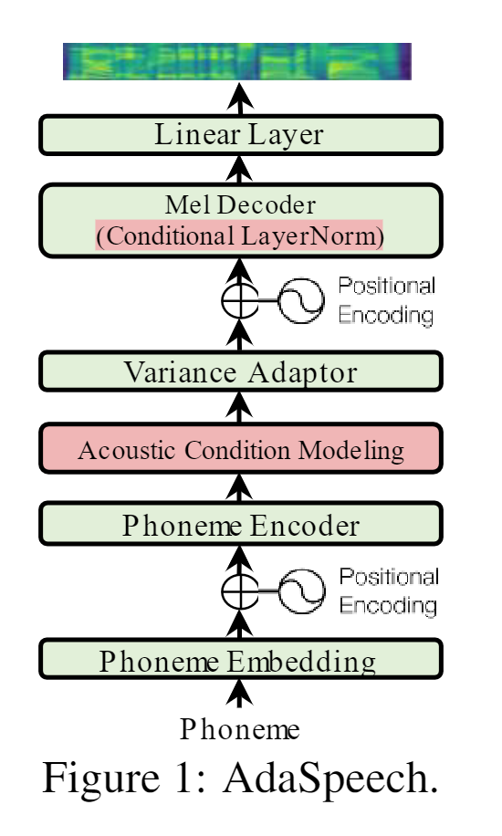

# Adaspeech Synthesize samples
This is a unofficial PyTorch implementation of Microsoft's text-to-speech system AdaSpeech: Adaptive Text to Speech for Custom Voice.

This project is based on ming024's implementation of FastSpeech. Feel free to use/modify the code.

  

# LJSpeech

<table>
    <tbody><tr>
      <th style="text-align: center">LJ013-0238 (Ground-Truth) </th>
      <th style="text-align: center">LJ013-0238 (Ground-Truth mel + Vocoder ) </th>
      <th style="text-align: center">LJ013-0238 (Synthesized mel + Vocoder) </th>
    </tr>
    <tr>
      <td style="text-align: center"><audio controls="controls">
          <source src="../_data/2023/2023_02_10/wav/LJ013-0238.wav" autoplay="">
        </audio></td>
      <td style="text-align: center"><audio controls="controls">
          <source src="./../_data/2023/2023_02_10/wav/LJ013-0238_original_mel.wav" autoplay="">
        </audio></td>
      <td style="text-align: center"><audio controls="controls">
          <source src="./../_data/2023/2023_02_10/wav/LJ013-0238_synthesized.wav" autoplay="">
        </audio></td>
    </tr>
  </tbody></table>

<b>Text</b>: <em>he was coachman to a gentleman at roehampton. one day he went into a pawnbroker's at wandsworth, and bought a pair of breeches on credit.
    </em>

 

<table>
    <tbody><tr>
      <th style="text-align: center">LJ028-0146 (Ground-Truth) </th>
      <th style="text-align: center">LJ028-0146 (Ground-Truth mel + Vocoder ) </th>
      <th style="text-align: center">LJ028-0146 (Synthesized mel + Vocoder) </th>
    </tr>
    <tr>
      <td style="text-align: center"><audio controls="controls">
          <source src="../_data/2023/2023_02_10/wav/LJ028-0146.wav" autoplay="">
        </audio></td>
      <td style="text-align: center"><audio controls="controls">
          <source src="../_data/2023/2023_02_10/wav/LJ028-0146_original_mel.wav" autoplay="">
        </audio></td>
      <td style="text-align: center"><audio controls="controls">
          <source src="./../_data/2023/2023_02_10/wav/LJ028-0146_synthesized.wav" autoplay="">
        </audio></td>
    </tr>
  </tbody></table>

<b>Text</b>: <em>as fast as they dug the moat, the soil which they got from the cutting was made into bricks,
    </em>

 

# KSS dataset

<table>
    <tbody><tr>
      <th style="text-align: center">3_4121 (Ground-Truth) </th>
      <th style="text-align: center">3_4121 (Ground-Truth mel + Vocoder ) </th>
      <th style="text-align: center">3_4121 (Synthesized mel + Vocoder) </th>
    </tr>
    <tr>
      <td style="text-align: center"><audio controls="controls">
          <source src="../_data/2023/2023_02_10/wav/3_4121.wav" autoplay="">
        </audio></td>
      <td style="text-align: center"><audio controls="controls">
          <source src="./../_data/2023/2023_02_10/wav/3_4121_original_mel.wav" autoplay="">
        </audio></td>
      <td style="text-align: center"><audio controls="controls">
          <source src="./../_data/2023/2023_02_10/wav/3_4121_synthesized.wav" autoplay="">
        </audio></td>
    </tr>
  </tbody></table>

<b>Text</b>: <em>이달 말까지 이 쿠폰을 사용하셔야 합니다
    </em>

 

<table>
    <tbody><tr>
      <th style="text-align: center">4_4416 (Ground-Truth) </th>
      <th style="text-align: center">4_4416 (Ground-Truth mel + Vocoder ) </th>
      <th style="text-align: center">4_4416 (Synthesized mel + Vocoder) </th>
    </tr>
    <tr>
      <td style="text-align: center"><audio controls="controls">
          <source src="../_data/2023/2023_02_10/wav/4_4416.wav" autoplay="">
        </audio></td>
      <td style="text-align: center"><audio controls="controls">
          <source src="./../_data/2023/2023_02_10/wav/4_4416_original_mel.wav" autoplay="">
        </audio></td>
      <td style="text-align: center"><audio controls="controls">
          <source src="./../_data/2023/2023_02_10/wav/4_4416_synthesized.wav" autoplay="">
        </audio></td>
    </tr>
  </tbody></table>

<b>Text</b>: <em>어떻게 하면 소비자와 생산자 둘 다 만족할 수 있을까
    </em>

 

# Discussion

In the inference step, Adaspeech's synthesis performance was highly dependent on the reference mel.

Which means, synthesis performance is expected to increase significantly if the emotional state of the speaker and the type of sentence (question, negative, etc.) are classified and used as a reference mel.